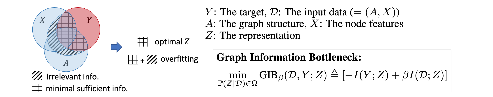

*****
GIB
*****

This repository reproduces the results in the paper `Graph Information Bottleneck <https://arxiv.org/abs/2010.12811>`_ (Tailin Wu :sup:`*`, Hongyu Ren :sup:`*`, Pan Li, Jure Leskovec, NeurIPS 2020), whose objective is to learn minimal sufficient structural and feature information using GNNs, which improves the robustness of GNNs. 

Representation learning on graphs with graph neural networks (GNNs) is a challenging task. Previous work has shown that GNNs are susceptible to adversarial attack. We here introduce Graph Information Bottleneck (GIB), which learns representation that is maximally informative about the target to predict while using minimal sufficient information of the input data. Concretely, the GIB principle regularizes the representation of the node features as well as the graph structure so that it increases the robustness of GNNs. For more information, see our paper `Graph Information Bottleneck <https://arxiv.org/abs/2010.12811>`_ (Wu *et al*. 2020), and our project website at `http://snap.stanford.edu/gib/ <http://snap.stanford.edu/gib/>`_.

Installation
==========================================================================
First clone the directory. Then run the following command to initialize the submodules:

.. code:: bash

   git submodule init; git submodule update

(If showing error of no permission, need to first `add a new SSH key to your GitHub account <https://docs.github.com/en/free-pro-team@latest/github/authenticating-to-github/adding-a-new-ssh-key-to-your-github-account>`_.)

The repository also has the following dependencies, and please refer to the respective page to install:

- `PyTorch <https://pytorch.org/>`_ >= 1.4.0

- `pytorch_geometric <https://github.com/rusty1s/pytorch_geometric>`_  >=1.4.0,<=1.5.1

Additional requirements are in requirements.txt, which can be installed via ``pip install -r requirements.txt``.

After installing the dependencies, cd to the directory "DeepRobust/", and install it by running:

.. code:: python

    pip install -e .

Usage
==========================================================================

The main experiment files are:

- Node-level experiments: `experiments/GIB_node_exp.ipynb <https://github.com/snap-stanford/GIB/blob/master/experiments/GIB_node_exp.ipynb>`_

- Node-level attacks: `experiments/GIB_node_attack_exp.ipynb <https://github.com/snap-stanford/GIB/blob/master/experiments/GIB_node_attack_exp.ipynb>`_

which can be run via command line or in Jupyter notebook.

The result files are saved under the "results/" folder.

The definition of GIB-GAT, GAT, GCN are in `experiments/GIB_node_model.ipynb <https://github.com/snap-stanford/GIB/blob/master/experiments/GIB_node_model.ipynb>`_.

The analysis script is `experiments/GIB_node_analysis.ipynb <https://github.com/snap-stanford/GIB/blob/master/experiments/GIB_node_analysis.ipynb>`_. 

Run adversarial attack experiments
==========================================================================
To run multiple attack experiments each with a different hyperparameter combination, run "run_exp/run_nettack_grid.py" by e.g.

.. code:: python

   python run_exp/run_nettack_grid.py ${Assign_ID} ${GPU_ID}

where each integer ``${Assign_ID}`` (0 to M-1) maps to a hyperparameter setting (M is the total number of hyperparameter settings), and ``${GPU_ID}`` is the ID (e.g. 0, 1, 2) of CUDA driver (set to False if using CPU).

Alternatively, to run a single attack experiment, use "run_exp/run_nettack.py". Below are the commands that produce the adversarial attack results in the paper (For node feature attacks, see the README in `run_exp/ <https://github.com/snap-stanford/GIB/blob/master/run_exp>`_). For the args, the "exp_id" and "date_time" are used to name the folder "{}_{}".format(exp_id, date_time) in which the results will be saved in. "gpuid" can also be set in a custom way. For each experiment, need to go over seeds of 0, 1, 2, 3, 4 then perform analysis, where in the following for brevity we only provide --seed=0. Also note that the following "data_type" all have suffix of "-bool", which makes the feature Boolean as required by Netteck. After running each experiment, use the script `experiments/GIB_node_analysis.ipynb <https://github.com/snap-stanford/GIB/blob/master/experiments/GIB_node_analysis.ipynb>`_ (Section 2) to perform analysis and obtain results.

**Cora with GIB-Cat**:

.. code:: bash

   python run_exp/run_nettack.py --exp_id=Cora-GIB-Cat --data_type=Cora-bool --model_type=GAT --beta1=0.001 --beta2=0.01 --struct_dropout_mode='\("DNsampling","multi-categorical-sum",1,3,2\)' --seed=0 --gpuid=0

**Cora with GIB-Bern**:

.. code:: bash

   python run_exp/run_nettack.py --exp_id=Cora-GIB-Bern --data_type=Cora-bool --model_type=GAT --beta1=0.001 --beta2=0.01 --struct_dropout_mode='\("DNsampling","Bernoulli",0.1,0.5,"norm",2\)' --seed=0 --gpuid=0

**Pubmed with GIB-Cat**:

.. code:: bash

   python run_exp/run_nettack.py --exp_id=Pubmed-GIB-Cat --data_type=Pubmed-bool --model_type=GAT --beta1=0.001 --beta2=0.01 --struct_dropout_mode='\("DNsampling","multi-categorical-sum",1,3,2\)' --seed=0 --gpuid=0

**Pubmed with GIB-Bern**:

.. code:: bash

   python run_exp/run_nettack.py --exp_id=Pubmed-GIB-Bern --data_type=Pubmed-bool --model_type=GAT --beta1=0.001 --beta2=0.01 --struct_dropout_mode='\("DNsampling","Bernoulli",0.1,0.5,"norm",2\)' --seed=0 --gpuid=0

**Citeseer with GIB-Cat**:

.. code:: bash

   python run_exp/run_nettack.py --exp_id=Citeseer-GIB-Cat --data_type=citeseer-bool --model_type=GAT --beta1=0.001 --beta2=0.01 --struct_dropout_mode='\("DNsampling","multi-categorical-sum",0.1,2,2\)' --seed=0 --gpuid=0

**Citeseer with GIB-Bern**:

.. code:: bash

   python run_exp/run_nettack.py --exp_id=Citeseer-GIB-Bern --data_type=citeseer-bool --model_type=GAT --beta1=0.001 --beta2=0.01 --struct_dropout_mode='\("DNsampling","Bernoulli",0.05,0.5,"norm",2\)' --seed=0 --gpuid=0

Other baselines:
########

**Cora with GAT**:

.. code:: bash

   python run_exp/run_nettack.py --exp_id=Cora-GAT --data_type=Cora-bool --model_type=GAT --beta1=-1 --beta2=-1 --struct_dropout_mode='\("standard",0.6\)' --seed=0 --gpuid=0
   
**Cora with GCN**:

.. code:: bash

   python run_exp/run_nettack.py --exp_id=Cora-GCN --data_type=Cora-bool --model_type=GCN --beta1=-1 --beta2=-1 --seed=0 --gpuid=0

**Cora with GCNJaccard**:

.. code:: bash

   python run_exp/run_nettack.py --exp_id=Cora-GCNJaccard --data_type=Cora-bool --model_type=GCNJaccard --beta1=-1 --beta2=-1 --latent_size=16 --lr=1e-2 --weight_decay=5e-4 --threshold=0.05 --seed=0 --gpuid=0

**Cora with RGCN**:

.. code:: bash

   python run_exp/run_nettack.py --exp_id=Cora-RGCN --data_type=Cora-bool --model_type=RGCN --beta1=5e-4 --beta2=-1 --latent_size=64 --lr=1e-2 --weight_decay=5e-4 --gamma=0.3 --seed=0 --gpuid=0

**Pubmed with GAT**:

.. code:: bash

   python run_exp/run_nettack.py --exp_id=Pubmed-GAT --data_type=Pubmed-bool --model_type=GAT --beta1=-1 --beta2=-1 --struct_dropout_mode='\("standard",0.6\)' --seed=0 --gpuid=0
   
**Pubmed with GCN**:

.. code:: bash

   python run_exp/run_nettack.py --exp_id=Pubmed-GCN --data_type=Pubmed-bool --model_type=GCN --beta1=-1 --beta2=-1 --seed=0 --gpuid=0

**Pubmed with GCNJaccard**:

.. code:: bash

   python run_exp/run_nettack.py --exp_id=Pubmed-GCNJaccard --data_type=Pubmed-bool --model_type=GCNJaccard --beta1=-1 --beta2=-1 --latent_size=16 --lr=1e-2 --weight_decay=5e-4 --threshold=0.05 --seed=0 --gpuid=0

**Pubmed with RGCN**:

.. code:: bash
   
   python run_exp/run_nettack.py --exp_id=Pubmed-RGCN --data_type=Pubmed-bool --model_type=RGCN --beta1=5e-4 --beta2=-1 --latent_size=16 --lr=1e-2 --weight_decay=5e-4 --gamma=0.1 --seed=0 --gpuid=0

**Citeseer with GAT**:

.. code:: bash

   python run_exp/run_nettack.py --exp_id=Citeseer-GAT --data_type=citeseer-bool --model_type=GAT --beta1=-1 --beta2=-1 --struct_dropout_mode='\("standard",0.6\)' --seed=0 --gpuid=0

**Citeseer with GCN**:

.. code:: bash

   python run_exp/run_nettack.py --exp_id=Citeseer-GCN --data_type=citeseer-bool --model_type=GCN --beta1=-1 --beta2=-1 --seed=0 --gpuid=0

**Citeseer with GCNJaccard**:

.. code:: bash

   python run_exp/run_nettack.py --exp_id=Citeseer-GCNJaccard --data_type=citeseer-bool --model_type=GCNJaccard --beta1=-1 --beta2=-1 --latent_size=16 --lr=1e-2 --weight_decay=5e-4 --threshold=0.05 --seed=0 --gpuid=0

**Citeseer with RGCN**:

.. code:: bash

   python run_exp/run_nettack.py --exp_id=Citeseer-RGCN --data_type=citeseer-bool --model_type=RGCN --beta1=5e-4 --beta2=-1 --latent_size=64 --lr=1e-2 --weight_decay=5e-4 --gamma=0.3 --seed=0 --gpuid=0

Ablation study:
########

**Cora with XIB**:

.. code:: bash

   python run_exp/run_nettack.py --exp_id=Cora-XIB --data_type=Cora-bool --model_type=GAT --beta1=0.001 --beta2=-1 --struct_dropout_mode='\("standard",0.6,2\)' --seed=0 --gpuid=0
   
**Cora with AIB-Cat**:

.. code:: bash

   python run_exp/run_nettack.py --exp_id=Cora-AIB-Cat --data_type=Cora-bool --model_type=GAT --beta1=-1 --beta2=0.01 --struct_dropout_mode='\("DNsampling","multi-categorical-sum",1,3,2\)' --seed=0 --gpuid=0

**Cora with AIB-Bern**:

.. code:: bash

   python run_exp/run_nettack.py --exp_id=Cora-AIB-Bern --data_type=Cora-bool --model_type=GAT --beta1=-1 --beta2=0.01 --struct_dropout_mode='\("DNsampling","Bernoulli",0.1,0.5,"norm",2\)' --seed=0 --gpuid=0

Citation
==========================================================================

If you compare with, build on, or use aspects of the Graph Information Bottleneck, please cite the following:

.. code:: bash

  @inproceedings{wu2020graph,
  title={Graph Information Bottleneck},
  author={Wu, Tailin and Ren, Hongyu and Li, Pan and Leskovec, Jure},
  booktitle={Neural Information Processing Systems},
  year={2020},
  }
